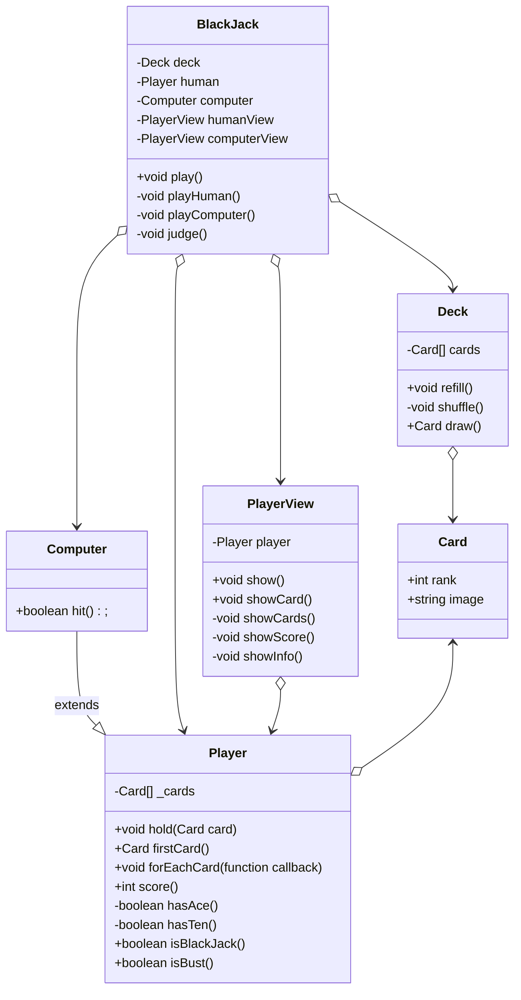

# はじめに
オブジェクト指向設計を考慮した実装

# カードクラス
## 必要な属性?
* ランク: 1～13の数値
* 画像パス

# デッキクラス
トランプのカードをまとめたもの
## 必要な属性
* カードリスト
## 必要な操作
* シャッフルしたカードを詰める
* カードを1枚取り出す

# プレイヤー
## 必要な属性
* 自分が持っているカードリスト
## 必要な操作
* カードをもらう
* 最初のカードを1枚だけ返す
* 持っているカードを全て処理する
* 点数を計算する
* ブラックジャック(Aと10点札)になっているかどうか
* バースト(点数が22以上)しているかどうか

# コンピューター (プレイヤーを継承)
## 必要な操作
* カードをもらうかどうか(16点以下なら必ずもらう)

# BlackJackゲームマスター
## 必要な属性
* デッキ
* 人間
* コンピュータ
## 必要な操作
* プレイする
* 人間がプレイする
* コンピュータがプレイする
* 勝者を判定する

